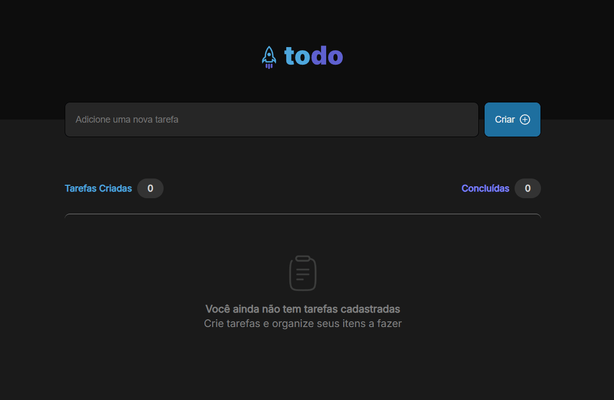

# Todo Application 🚀

Bem-vindo ao **Todo Application**, um projeto desenvolvido para ajudar estagiários da minha antiga empresa a entenderem os conceitos essenciais de desenvolvimento frontend. Este repositório oferece uma aplicação simples de _to-do list_, mas com grande foco em ensinar boas práticas de estruturação, design e comportamento de aplicações.

## 📚 Objetivos do Projeto

Este projeto foi criado com a intenção de ilustrar conceitos fundamentais para iniciantes no desenvolvimento de interfaces. Ele foi especialmente projetado para os estagiários entenderem e aplicarem os seguintes tópicos:

### ✨ **Componentização**

Aprenda a criar **componentes reutilizáveis** que ajudam a manter o código organizado e escalável. A estrutura modular facilita a manutenção e a expansão do projeto.

### 🎨 **Estrutura de Layout**

A aplicação adota um layout moderno e clean, priorizando uma navegação intuitiva e design agradável ao usuário. Aqui, os estagiários aprenderão como pensar a estrutura de uma aplicação de forma visualmente harmônica.

### 📱 **Design Responsivo**

Com o foco em acessibilidade e usabilidade, a aplicação se adapta perfeitamente a diversos tamanhos de tela, garantindo que o usuário tenha uma experiência consistente, seja no desktop ou no mobile.

### 🛠️ **Comportamento Esperado**

A interação do usuário é simples e intuitiva. Marcar uma tarefa como concluída gera feedback visual imediato, proporcionando uma experiência fluida e de fácil compreensão.

### 🧩 **Uso de Mocks**

Como a aplicação não faz requisições para servidores, ela utiliza **mocks** para simular dados e interações. Este conceito foi implementado para mostrar aos estagiários como criar aplicações que não dependem de backends, utilizando dados simulados para testes e aprendizado.

## 🌟 Design Visual

A interface foi projetada para ser **clean**, com cores suaves e uma navegação fácil. O objetivo foi criar um visual que fosse agradável e estimulante, sem sobrecarregar o usuário com elementos desnecessários.

Confira como a aplicação se parece no seu funcionamento:

Cada elemento visual foi pensado para não só funcionar bem, mas também ser **visualmente atraente**, com animações suaves e uma experiência de uso sem fricções.

## 🔧 Tecnologias Usadas

- **React**: Para a construção dos componentes e gerenciamento de estados.
- **CSS Flexbox e Grid**: Para a criação de layouts responsivos e flexíveis.
- **Mocking de dados**: Para demonstrar o comportamento da aplicação sem dependências externas.

Este projeto oferece uma excelente base para entender como começar a construir aplicações modernas com uma arquitetura simples e eficiente.
